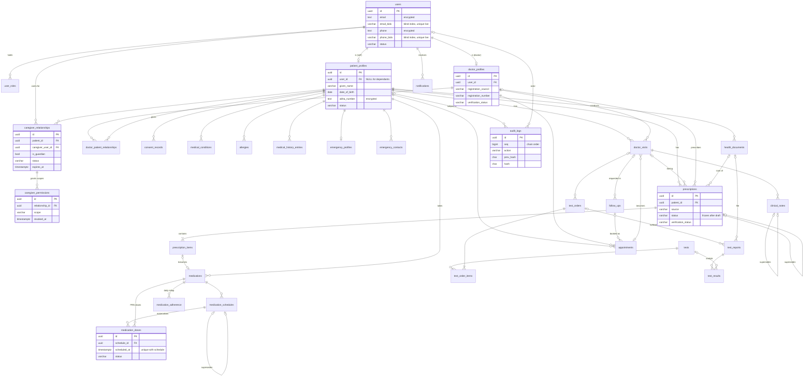

# Data model

PostgreSQL 16 schema for the platform: 31 tables across 14 modules. The source of truth is the SQLAlchemy models (`apps/api/app/modules/*/models.py`) and the Alembic migrations (`apps/api/alembic/versions/`). This document explains the design; CI checks that models and migrations never drift (`alembic check`).

Related: [ARCHITECTURE.md](../ARCHITECTURE.md) §4 and §21 · [SECURITY_MODEL.md](../SECURITY_MODEL.md) · [PROJECT_RULES.md](../PROJECT_RULES.md) §4

## Contents
1. [Conventions](#1-conventions)
2. [Entity relationship diagram](#2-entity-relationship-diagram)
3. [Tables by module](#3-tables-by-module)
4. [Key relationships](#4-key-relationships)
5. [Ownership boundaries](#5-ownership-boundaries)
6. [History and immutability](#6-history-and-immutability)
7. [Privacy](#7-privacy)
8. [Auditability](#8-auditability)
9. [Indexes](#9-indexes)
10. [Scalability](#10-scalability)
11. [Adding or changing a table](#11-adding-or-changing-a-table)

---

## 1. Conventions

| Convention | Implementation |
|---|---|
| **Identifiers** | UUIDv7 primary key `id` on every table, generated in the app (`app/core/ids.py`). Time-ordered, so indexes stay compact; not guessable, so IDs can safely appear in URLs |
| **Timestamps** | `created_at`, `updated_at` (`timestamptz`, UTC). A trigger (`hio_touch_updated_at`) keeps `updated_at` correct even for raw SQL |
| **Actors** | `created_by`, `updated_by` → `users.id` (NULL means "system"). Tables with extra actions have explicit actor columns (`signed_by`, `verified_by`, `cancelled_by`, `revoked_by`, `withdrawn_by`, …) |
| **Soft deletion** | `deleted_at`, `deleted_by` on user-editable records: `users`, `patient_profiles`, `medical_conditions`, `allergies`, `medical_history_entries`, `health_documents`, `emergency_contacts`. Clinical records with a lifecycle use a status such as `entered_in_error` instead of deletion |
| **Status fields** | VARCHAR + CHECK constraint (`app/core/models.py:str_enum`), not native PG enums, so adding a value is a simple transactional migration |
| **Optimistic locking** | `version` column on records edited concurrently; a stale write raises `StaleDataError` (maps to 409 `version-conflict`) |
| **Constraint names** | Deterministic naming convention (`ck_<table>_<name>`, `fk_…`, `uq_…`, `ix_…`), so migrations are reproducible |
| **ORM relationships** | Only inside a module. Cross-module links are plain foreign keys (PROJECT_RULES §2) |

## 2. Entity relationship diagram

Columns are abbreviated to keys and the most important fields. `PK` = primary key, `FK` = foreign key; composite patient-scoped keys are described in §5.

## 3. Tables by module

| Module | Table | Entity | Purpose | Soft delete | Immutable after |
|---|---|---|---|---|---|
| identity | `users` | User | People who can sign in; encrypted email and phone with blind indexes | ✓ | — |
| identity | `user_roles` | (role grants) | Role history; revoked, never deleted | | |
| patients | `patient_profiles` | PatientProfile | The health subject. `user_id` is NULL for dependants | ✓ | — |
| care_team | `doctor_profiles` | DoctorProfile | Any specialty; council registration and verification | | |
| care_team | `doctor_patient_relationships` | DoctorPatientRelationship | Doctor ↔ patient (many-to-many) with lifecycle | | no delete |
| caregivers | `caregiver_relationships` | CaregiverRelationship | Who helps whom; guardianship; expiry | | no delete |
| caregivers | `caregiver_permissions` | CaregiverPermission | One row per granted scope; revoked, never deleted | | no delete |
| consent | `consent_records` | ConsentRecord | DPDP consent: purpose, data categories, notice version | | on insert (lifecycle only) |
| clinical | `medical_conditions` | MedicalCondition | Problem list with clinical and verification status, ICD-10 | ✓ | |
| clinical | `allergies` | Allergy | Allergies and intolerances with severity | ✓ | |
| clinical | `medical_history_entries` | MedicalHistory | Surgical, hospitalisation, family, social and immunisation history; approximate dates | ✓ | |
| clinical | `doctor_visits` | DoctorVisit | Encounter; anchors notes, orders and prescriptions | | |
| clinical | `clinical_notes` | ClinicalNote | Encrypted note body; amended by supersession | | `signed` |
| prescriptions | `prescriptions` | Prescription | Doctor-issued, uploaded, manual or integration | | `issued` / `recorded` |
| prescriptions | `prescription_items` | PrescriptionItem | One medicine line, as written plus structured | | with parent |
| medications | `medications` | Medication | The patient's actual regimen | | no delete |
| medications | `medication_schedules` | MedicationSchedule | Fixed times, interval or PRN; versioned by supersession | | no delete |
| medications | `medication_doses` | MedicationDose | Each dose event (scheduled → taken/skipped/missed…) | | taken/skipped: no delete |
| medications | `medication_adherence` | MedicationAdherence | Daily rollup per medication; computed ratio | | |
| labs | `tests` | Test | Catalogue of tests and analytes (LOINC); reference data | | |
| labs | `test_orders` | TestOrder | Doctor's order header | | |
| labs | `test_order_items` | (order lines) | Tests on an order | | |
| labs | `test_reports` | TestReport | A report, often from an uploaded document | | `verified` |
| labs | `test_results` | (analyte values) | Values as printed, with unit and range | | with parent |
| appointments | `appointments` | Appointment | Scheduled time with a doctor; no double booking | | |
| appointments | `follow_ups` | FollowUp | "Review in 2 weeks" instructions | | |
| records | `health_documents` | HealthDocument | File metadata; bytes live in object storage | ✓ | |
| emergency | `emergency_profiles` | EmergencyProfile | What responders may see (patient-controlled) | | |
| emergency | `emergency_contacts` | (contacts) | Encrypted names and phones; priority order | ✓ | |
| notifications | `notifications` | Notification | Per recipient per channel; delivery state | | |
| audit | `audit_logs` | AuditLog | Append-only, hash-chained audit trail | | always |

**Naming against the requested entities:** *MedicalHistory* → `medical_history_entries`; *MedicationDose* → `medication_doses` (dose events); *Test* → `tests` (catalogue), with patient data in *TestOrder*/*TestReport* plus the supporting `test_order_items` and `test_results`; *CaregiverPermission* → one row per scope in `caregiver_permissions`.

## 4. Key relationships

| Relationship | How it is modelled |
|---|---|
| Doctor → many patients, patient → many doctors | `doctor_patient_relationships` (join table with lifecycle). Only one *open* relationship per pair (partial unique index); ended ones stay as history |
| Patient → many visits | `doctor_visits.patient_id`; each visit has one doctor, an optional appointment, and many notes |
| Patient → many prescriptions | `prescriptions.patient_id`; optional visit, prescriber, source document; supersession chain |
| Prescription → many items | `prescription_items.prescription_id` (composite FK with `patient_id`); `(prescription_id, sequence)` unique |
| Prescription → medications | `medications.prescription_item_id` (composite FK). One live medication per item (partial unique index). Self-reported medicines have no item |
| Medication → schedules | `medication_schedules.medication_id`; schedule changes end one row and create the next (`supersedes_schedule_id`) |
| Schedule → dose events | `medication_doses.schedule_id`; `(schedule_id, scheduled_at)` unique so materialisation is idempotent. The FK `(schedule_id, medication_id, patient_id)` guarantees the schedule belongs to the same medication and patient. PRN doses have no schedule |
| Patient → tests and reports | `test_orders` (doctor), `test_reports` (from an order, an upload or an integration) → `test_results` |
| Patient → many caregivers | `caregiver_relationships`; `is_guardian` for dependants (requires a `guardian_basis`) |
| Caregiver → permission-based access | `caregiver_permissions`: one active row per `(relationship, scope)`; revocation sets `revoked_at` |
| Dependant patients | `patient_profiles.user_id IS NULL`, managed through guardian relationships |

## 5. Ownership boundaries

- Every patient-owned table has `patient_id NOT NULL` with an index leading on it (checked by `tests/test_schema_rules.py`). This keeps authorisation filters, consent checks, data export and erasure mechanical.
- **Child rows cannot cross patients.** Parents expose `UNIQUE (id, patient_id)`, and children reference them with a composite FK `(parent_id, patient_id)`. For example, a prescription item for patient B cannot point at patient A's prescription; the database rejects it (tested). This applies to items, notes, schedules, doses, results, and links to visits, documents and appointments.
- Doctors, caregivers and admins own no patient data; their access is resolved at request time from relationships, permissions and consent (ARCHITECTURE §7).
- Reference data (`tests`) has no patient ownership.

## 6. History and immutability

Rules are enforced by **database triggers** (migration `0002`), so they hold even for raw SQL or a bug in a service:

| Record | Rule | On violation |
|---|---|---|
| `clinical_notes` | Once `signed`: content frozen; only `signed → superseded / entered_in_error` and `superseded → entered_in_error`; no delete. Corrections are new notes with `supersedes_note_id` and `amendment_reason` (one amendment per note) | `HI001` / `HI002` |
| `prescriptions` | Once `issued` or `recorded`: content frozen; only cancellation fields and status may change (`issued → cancelled/superseded/entered_in_error`, `recorded → superseded/entered_in_error`); no delete | `HI001` / `HI002` |
| `prescription_items` | No insert, update or delete while the parent is not `draft` | `HI001` |
| `test_reports` / `test_results` | Frozen once `verified` (results locked while the parent is not `pending_review`) | `HI001` / `HI002` |
| `consent_records` | Scope fixed at creation; only `active → withdrawn/expired/superseded`; never deleted | `HI001` / `HI002` |
| `audit_logs` | No UPDATE, DELETE or TRUNCATE | `HI001` |
| History tables (users, profiles, relationships, permissions, consents, medications, schedules, problems, allergies, history, documents) and taken/skipped doses | No hard delete, except inside the DPDP erasure or retention workflow, which runs `SET LOCAL hio.allow_hard_delete = 'on'` in an audited transaction | `HI001` |

`HI001` (immutable) and `HI002` (invalid transition) map to HTTP 409 in the API.

**Provenance** is always recorded: `source` (`doctor`, `patient`, `caregiver`, `ai_extraction`, `integration`, `system`) and verification fields. AI-extracted data is stored only after a person verifies it (AI_SAFETY.md §3). An uploaded prescription can reach `recorded` only with `verification_status` of `patient_verified` or `doctor_verified` plus `verified_by`/`verified_at` (CHECK constraint).

## 7. Privacy

- **Application-level encryption** (AES-256-GCM, `app/core/crypto.py`) for identifiers and free text that could reveal health information:

  | Table | Encrypted columns |
  |---|---|
  | users | `email`, `phone` |
  | patient_profiles | `abha_number`, `abha_address` |
  | clinical_notes | `body` |
  | doctor_visits | `chief_complaint` |
  | medical_conditions | `notes` |
  | medical_history_entries | `details` |
  | prescriptions | `diagnosis_as_written`, `advice` |
  | test_orders / test_reports | `clinical_indication` / `conclusion` |
  | health_documents | `title`, `description`, `original_filename` |
  | appointments / follow_ups | `reason` |
  | emergency_profiles | `critical_information`, `advance_directive` |
  | emergency_contacts | `name`, `phone` |
  | notifications | `title`, `body` |
  | audit_logs | `justification` |

  Each ciphertext is bound to its column (associated data), so it cannot be copied into another column. Keys carry an ID for rotation. **Blind indexes** (keyed HMAC) give exact-match lookup and uniqueness on `users.email_bidx`, `users.phone_bidx` and `patient_profiles.abha_number_bidx`.
- **Deliberately plaintext** (needed for search, sorting and safety checks, and protected by disk encryption, access policy and audit): patient names and date of birth, condition, allergy and drug names, lab values.
- **Minimisation:** `notifications.data` holds IDs only; object-storage keys never contain names; audit rows store field *names*, never values; IPs are truncated to /24 (IPv4) or /48 (IPv6).
- **No realistic data in the repository:** there is no seed data. Tests use neutral placeholders.

## 8. Auditability

- `audit_logs` records who (`actor_user_id`, `actor_role`), whose data (`patient_id`, including the patient a caregiver acts for), what (`action`, `resource_type`, `resource_id`, `changed_fields`), outcome and policy reason, and request correlation (`request_id`).
- **Tamper evidence:** `hash = SHA-256(prev_hash ‖ canonical row)`, ordered by `seq` (an identity column). `app/modules/audit/service.py` writes events inside the business transaction (serialised by an advisory lock) and `verify_chain()` recomputes the chain. The tests show that even an edit made with triggers disabled is detected.
- Every table also carries `created_by`/`updated_by` and lifecycle actor columns, so the latest state is attributable without reading the audit log.

## 9. Indexes

Beyond primary keys and every FK used for joins:

| Purpose | Index |
|---|---|
| Patient-scoped reads (chart, timeline) | `(patient_id, <time>)` on visits, notes, prescriptions, doses, reports, appointments, adherence, audit |
| Login lookup and uniqueness of live accounts | Partial unique on `users.email_bidx` / `phone_bidx` `WHERE deleted_at IS NULL` |
| One open relationship per pair | Partial unique on doctor–patient and caregiver–patient `WHERE status IN (open statuses)` |
| One active grant per caregiver scope | Partial unique `(relationship_id, scope) WHERE revoked_at IS NULL` |
| Reminder dispatch | Partial `medication_doses(scheduled_at) WHERE status IN ('scheduled','snoozed')` |
| Notification dispatch and inbox | Partial `(scheduled_for) WHERE status='pending'`; `(recipient_user_id, created_at) WHERE channel='in_app' AND read_at IS NULL` |
| Doctor work queues | Open orders and open follow-ups per doctor (partial) |
| No double booking | GiST exclusion `(doctor_id =, tstzrange(starts_at, ends_at) &&)` for live appointments (needs `btree_gist`) |
| Idempotency | `notifications.idempotency_key` unique; `(schedule_id, scheduled_at)` unique |

## 10. Scalability

- **UUIDv7 keys** insert in time order, which keeps B-tree growth local.
- **High-volume tables** (`medication_doses`, `notifications`, `audit_logs`) have no inbound foreign keys, so each can be converted to monthly range partitioning (`scheduled_at` / `created_at` / `occurred_at`) without schema changes elsewhere.
- **The audit chain** is serialised by one advisory lock, which is simple and correct at launch volume. If it becomes a bottleneck, it can be sharded (for example, one chain per patient) without changing the table.
- **Module-owned tables** mean a module can later move to its own schema or database; cross-module foreign keys would become IDs checked by the owning service.
- **Row-Level Security** on `patient_id` is planned as defence in depth (roadmap Phase 20) and fits the existing scoping.

## 11. Adding or changing a table

1. Add the model in its module's `models.py` using the mixins (`Entity`, `PatientOwned`, `SoftDelete`, `OptimisticLock`) and helpers (`str_enum`, `user_fk`, `patient_scoped_fk`, `patient_scope_key`), and register it in `app/models.py`.
2. `uv run alembic revision --autogenerate -m "..."`, then **review the file**: encrypted columns render as `sa.Text()`; add triggers (`hio_touch_updated_at`, `hio_guard_delete`, freeze rules) in the same migration.
3. Write a real `downgrade()`; run `upgrade head → downgrade base → upgrade head` locally.
4. Run `uv run pytest` (schema-rule tests) and `HIO_INTEGRATION=1 uv run pytest -m integration`; CI also runs `alembic check` for drift.
5. Update this document and, for a new data category or purpose, `docs/dpdp-register.md`.
